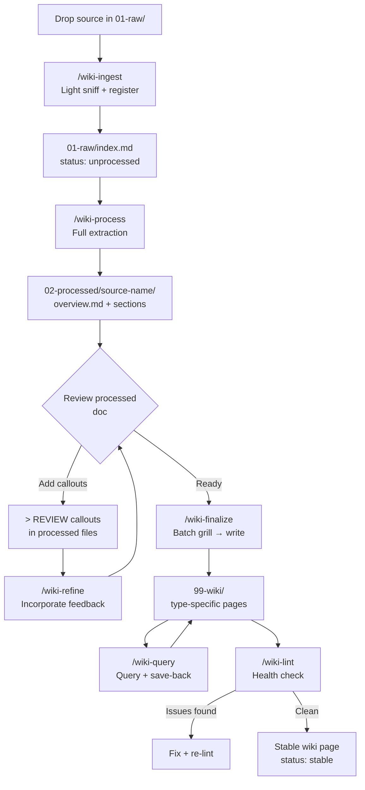

# AGENTS.md

AI assistant entrypoint for the AWS Clickstream + AgentCore observability wiki.

## What this project is

A research knowledge base and architecture reference for designing a solution that tracks clickstream engagement metrics and correlates them with AWS AgentCore chatbot performance observability. See `purpose.md` for goals and key questions. See `99-wiki/overviews/` for domain entry points once the wiki is populated.

## Three-layer structure

```
01-raw/          ← immutable source documents (never modify)
02-processed/    ← structured extractions, one folder per source
99-wiki/         ← synthesized architecture guidance (publishable output)
registry.md      ← canonical domains, tags, concepts, components — always read before writing frontmatter
schema.md        ← full conventions for all three layers
purpose.md       ← why this wiki exists
```

## Core rules

- **Never modify files in `01-raw/`** — they are the immutable source of truth
- **Always read `registry.md` before writing any frontmatter** — use only canonical terms
- **Always read `schema.md` at the start of any wiki operation** — it contains all format specs
- **Propose registry additions, never silently introduce new terms**
- **Use `> [!REVIEW]` callout syntax for inline feedback** — strip after incorporating
- **Brain dump sources are incomplete and potentially inaccurate** — structure and scaffold only, never assert hard facts from them
- **Never research, process, or create wiki pages for topics listed in `backlog.md`** — they are parked until the user explicitly promotes them via `/wiki-backlog promote <slug>` or says "research backlog: `<slug>`"

## Frontmatter field definitions

Every page across all three layers uses these four metadata fields. Use only canonical values from `registry.md`.

| Field | Answers | Example values |
|---|---|---|
| `domain` | *"What topic space does this live in?"* | `clickstream`, `agentcore`, `data-pipeline`, `observability`, `web-app`, `dashboards` |
| `tags` | *"What specific technologies/services are involved?"* | `kinesis-data-firehose`, `google-tag-manager`, `opentelemetry`, `flink` |
| `concepts` | *"What generic, transferable idea or technique?"* | `streaming-ingestion`, `server-side-tagging`, `event-correlation`, `otel-instrumentation` |
| `components` | *"Which part of OUR architecture does this relate to?"* | `clickstream-ingestion-pipeline`, `agent-otel-backend`, `metrics-dashboard` |

**Key distinctions:**
- `tags` = WHAT tools/services (e.g. `kinesis-data-firehose`)
- `concepts` = WHAT idea/technique (e.g. `streaming-ingestion`)
- `components` = WHICH part of the system (e.g. `clickstream-ingestion-pipeline`)
- A single page about Firehose buffering config uses all three: `tags: [kinesis-data-firehose]`, `concepts: [streaming-ingestion]`, `components: [clickstream-ingestion-pipeline]`

**Components are function-level, not variant-level.** `clickstream-ingestion-pipeline` covers all implementation variants (MSK, Firehose, etc.). Which services are used → `tags`. Which variant was chosen → `decision-record` page type.

## Workflow commands

| Command | What it does |
|---|---|
| `/wiki-ingest <filepath>` | Light sniff + register source in `01-raw/index.md` |
| `/wiki-process <filepath\|--tag\|--domain>` | Full extraction → structured `02-processed/` folder |
| `/wiki-finalize <processed-folder>` | Batch grill → integrate into `99-wiki/` with cross-links |
| `/wiki-refine <filepath\|--layer\|--all>` | Incorporate `> [!REVIEW]` callout feedback |
| `/wiki-query "<question>"` | Query wiki + optional save-back as new page |
| `/wiki-lint` | Health-check all three layers, report issues |
| `/wiki-refine-terms` | Registry hygiene — detect duplicates, alias drift, propose normalizations |
| `/wiki-backlog <add\|list\|promote\|remove>` | Manage parked topics — track without researching |
| `/workflow-improve "<feedback>"` | Evolve the workflow itself |

Full command specs live in `.agents/workflows/`. Symlinked to `.claude/commands/`.

## Typical session flow

```
1. Drop source into 01-raw/<subfolder>/
2. /wiki-ingest 01-raw/...          → registers with light sniff
3. /wiki-process 01-raw/...         → creates 02-processed/<folder>/
4. Review 02-processed/<folder>/    → add > [!REVIEW] callouts
5. /wiki-finalize 02-processed/...  → integrates into 99-wiki/ (grills first)
6. /wiki-lint                       → health-check
```

## Wiki page types

`architecture` · `concept` · `pattern` · `decision-record` · `how-to-guide` · `data-pipeline` · `comparison` · `glossary` · `overview`

All page frontmatter specs in `schema.md`. Status progression: `draft → reviewed → stable`.

## Workflow diagram


